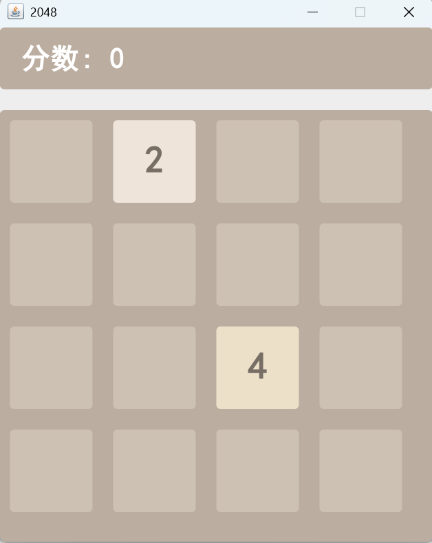
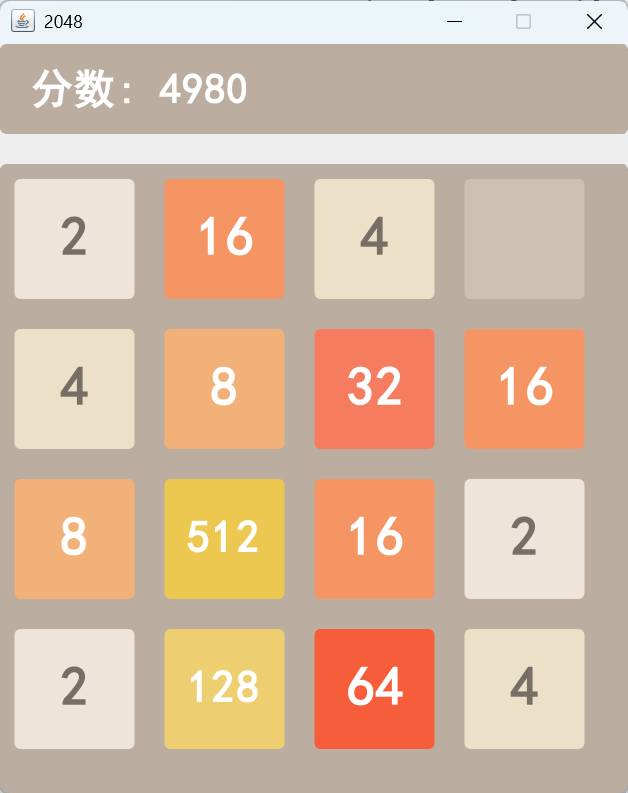
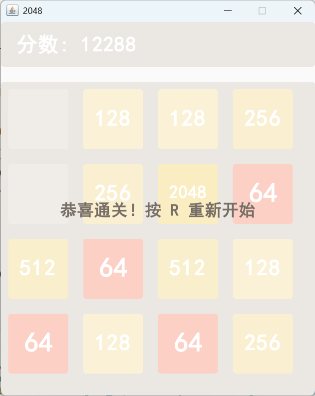
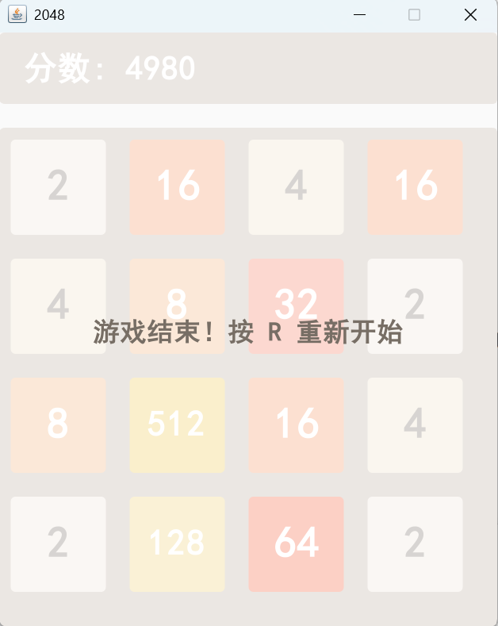

# Game 2048 — Java Swing 实现

一个基于 Java Swing 实现的 2048 小游戏，Java 程序设计课程的实验项目。

## 界面预览

<table>
  <tr>
    <td align="center"><br/>开始界面</td>
    <td align="center"><br/>游戏进行中</td>
  </tr>
  <tr>
    <td align="center"><br/>通关（演示效果）</td>
    <td align="center"><br/>游戏结束（棋盘已满，无可合并）</td>
  </tr>
</table>

> **说明**：上图中"通关"画面为演示效果——为了展示通关界面，截图时临时把随机生成的数字改成 64 / 128，凑出 2048 触发通关判定。作者本人目前尚未通关。欢迎大家积极挑战，通关后可以把通关截图发到仓库的 Discussion 区一起交流！

## 当前状态

### 功能特性

- 4×4 棋盘，标准 2048 玩法
- 方向键（↑ ↓ ← →）控制方块移动与合并
- 顶部实时显示当前分数
- 合成 2048 方块触发通关判定
- 无空格且无相邻可合并方块时游戏结束
- 按 `R` 键随时重新开始
- 仿原版 2048 的方块配色（2 ~ 2048）
- 游戏结束 / 通关时显示半透明遮罩提示

### 实现说明

项目为单文件实现（`Game2048.java`），核心设计如下：

- **数据结构**：使用 `int[4][4]` 二维数组存储棋盘状态，`0` 表示空格。
- **移动与合并**：`moveAndMerge()` 对单行先压缩（去除空格 0）、再对相邻相同数字合并（每个方块每步只合并一次）、最后再次压缩，一次性完成"滑动 + 合并 + 滑动"。
- **四个方向**：通过 `rotate()` 将棋盘整体顺时针旋转，把上、下、右三个方向统一转换为"向左移动"，四个方向共用同一套合并逻辑。
- **随机方块**：`addRandomTile()` 在剩余空格中等概率生成 2 或 4。
- **结束判定**：`isGameOver()` 检查棋盘无空格且任意相邻格子均不相等时判定游戏结束。
- **界面渲染**：内部类 `GamePanel` 继承 `JPanel`，重写 `paintComponent()` 完成绘制，开启抗锯齿；分数栏与棋盘分区布局。

### 运行方式

需要 JDK 8 及以上版本。

```bash
# 编译
javac Game2048.java

# 运行
java Game2048
```

## 后续改进

以下是后续可考虑的改进方向，按类别整理：

### 游戏机制

- **撤销上一步（Undo）**：记录每步移动前的棋盘状态，按 `Z` 或点击按钮回退一步，方便失误时挽救。
- **最高分记录**：将历史最高分持久化到本地文件，重启程序后仍能查看。
- **难度设置**：目前新方块按 50% / 50% 生成 2 或 4（比原版的 90% / 10% 更硬核）。可提供难度选项（简单 / 标准 / 困难），或把生成概率做成可配置项。
- **继续挑战 4096**：通关 2048 后不结束，继续向 4096 甚至 8192 冲击，挑战更高目标。

### 交互与界面

- **鼠标操作**：点击"重新开始"按钮或棋盘即可重开 / 恢复焦点，弥补目前方向键失焦后失效的问题（后续可改用 `WHEN_IN_FOCUSED_WINDOW` 键绑定从根上修复）。
- **移动动画**：为方块滑动、合并、新方块生成添加平滑动画，让操作反馈更直观。
- **音效**：合并、通关、失败时播放提示音，增强游戏沉浸感。
- **界面主题**：支持浅色 / 深色主题切换，或提供多套配色方案。

### AI 辅助

- **提示功能**：按 `H` 键显示 AI 计算出的最佳下一步方向，帮助新手学习策略。
- **自动演示**：按 `A` 键让 AI 自动玩一局，直观展示高分局是怎么打出来的。

### 工程化

- **多文件重构**：将单文件拆分出棋盘逻辑、渲染、入口等模块，便于维护与扩展。
- **单元测试**：引入 JUnit，为移动 / 合并 / 结束判定等核心逻辑编写自动化测试。
- **构建工具**：接入 Maven / Gradle 管理依赖与构建流程，替代直接 `javac` 编译。
